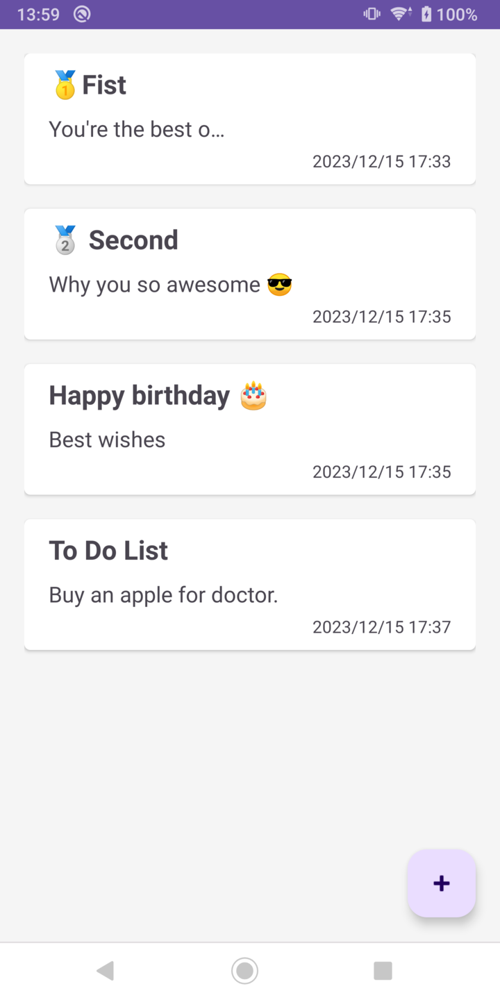
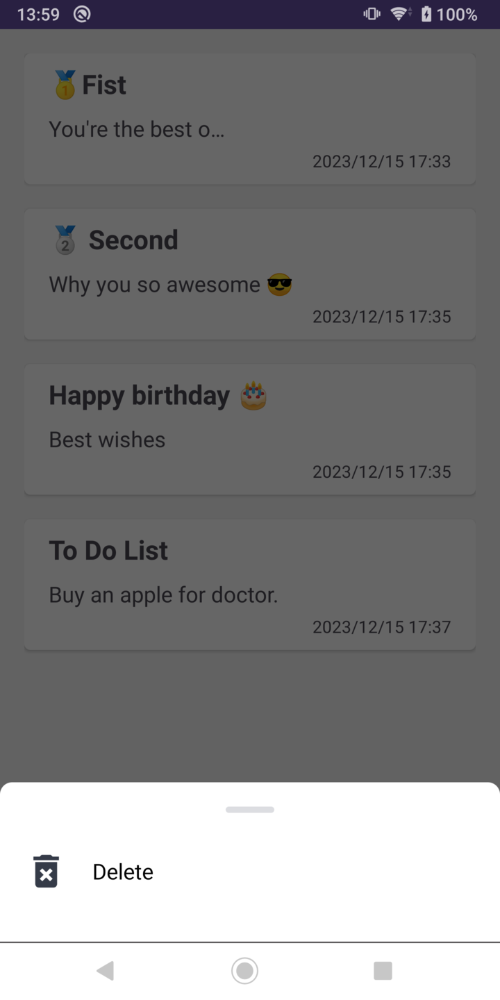
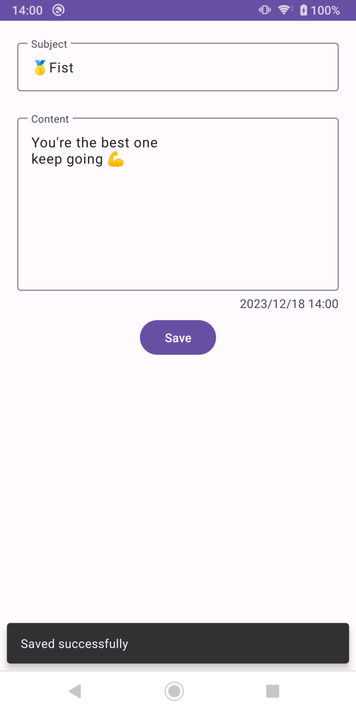

# KtRoomDB

### Demo

- Room (CRUD)
- Flow + Coroutines
- LiveData
- ViewModel





### NoteEntity

``` Kotlin
@Entity(tableName = "table_note")
data class NoteEntity(
    @PrimaryKey(autoGenerate = true)
    var noteId: Int = 0,
    
    @ColumnInfo(name = "editor_name")
    var editorName: String? = null,
    
    @ColumnInfo(name = "subject")
    var subject: String? = null,
    
    @ColumnInfo(name = "content")
    var content: String? = null,
    
    @ColumnInfo(name = "update_time")
    var updateTime: Long? = System.currentTimeMillis(),
)
```

### DAO file
``` Kotlin
@Dao
interface NoteDao {
    @Query("Select * from table_note")
    fun queryAllNotes(): Flow<List<NoteEntity>?>

    @Query("Select * from table_note TN where TN.noteId = :noteId")
    fun queryNoteById(noteId: Int): Flow<NoteEntity?>

    @Insert(onConflict = OnConflictStrategy.ABORT)
    suspend fun insertNotes(note: NoteEntity): Long

    @Update(onConflict = OnConflictStrategy.ABORT)
    suspend fun updateNote(note: NoteEntity)

    @Delete
    suspend fun deleteNote(note: NoteEntity)
}
```